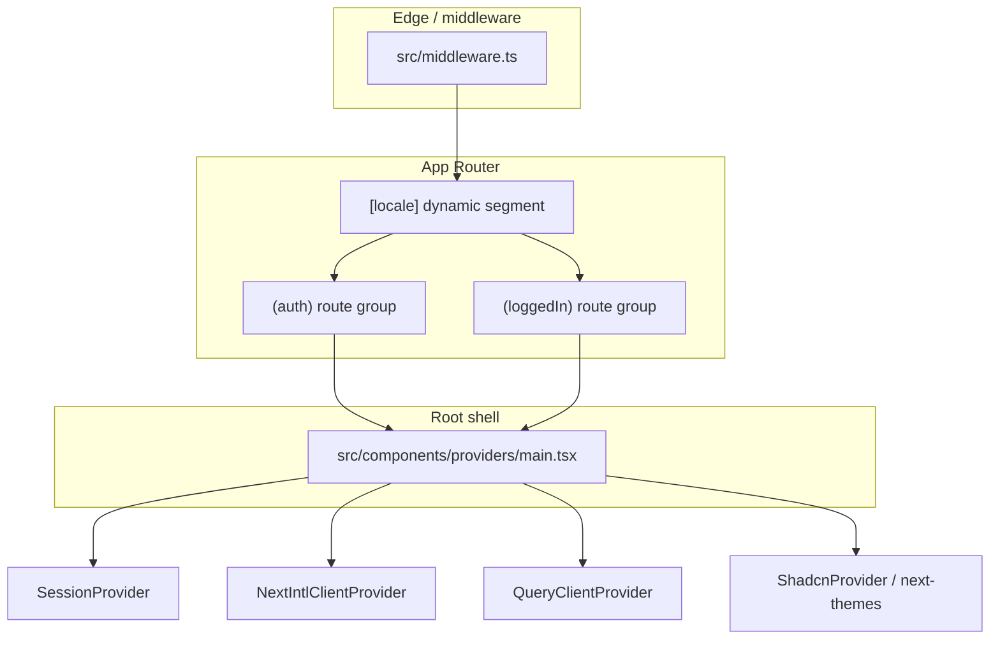

# Front-End Project Template

A production-oriented **Next.js** starter for localized, authenticated apps. It ships with **internationalization (EN / AR)**, **credentials-based auth** (NextAuth v5), **TanStack Query** data hooks, **shadcn/ui**-style components on **Radix** primitives, and a **Tailwind CSS v4** design system. Use it as a GitHub template and wire your own backend.

---

## Requirements

| Tool            | Version                                                             |
| --------------- | ------------------------------------------------------------------- |
| Node.js         | **≥ 20** (see `package.json` → `engines`)                           |
| Package manager | **pnpm** (lockfile: `pnpm-lock.yaml`; Husky pre-commit uses `pnpm`) |

---

## Tech stack

### Core

| Technology                                                                   | Role                                                              |
| ---------------------------------------------------------------------------- | ----------------------------------------------------------------- |
| **[Next.js 15](https://nextjs.org/)** (App Router)                           | Routing, RSC, API routes, `next dev --turbopack`                  |
| **[React 19](https://react.dev/)**                                           | UI                                                                |
| **[TypeScript 5](https://www.typescriptlang.org/)**                          | Strict typing (`strict: true` in `tsconfig.json`)                 |
| **[Tailwind CSS v4](https://tailwindcss.com/)** + **`@tailwindcss/postcss`** | Utility-first styling (`src/styles/globals.css`, `@theme inline`) |
| **[tw-animate-css](https://github.com/Wombosvideo/tw-animate-css)**          | Animation utilities imported in global CSS                        |

### Internationalization & UX

| Library                                             | Role                                                                                      |
| --------------------------------------------------- | ----------------------------------------------------------------------------------------- |
| **[next-intl](https://next-intl-docs.vercel.app/)** | Locale routing, message loading, `Link` / `redirect` / `useRouter` wrappers (`src/i18n/`) |
| **JSON messages**                                   | `messages/en/*.json`, `messages/ar/*.json` (namespaces: `common`, `auth`)                 |

### Authentication & API

| Library                                                      | Role                                                                    |
| ------------------------------------------------------------ | ----------------------------------------------------------------------- |
| **[NextAuth.js v5](https://authjs.dev/)** (`next-auth@beta`) | JWT sessions, Credentials provider (`src/app/[locale]/authentication/`) |
| **[Axios](https://axios-http.com/)**                         | HTTP client with base URL, timeout, tenant header (`src/lib/client.ts`) |
| **Next.js Route Handlers**                                   | `/api/auth/*` — login, logout, NextAuth catch-all                       |

### Data fetching & forms

| Library                                                                                                                                                     | Role                                              |
| ----------------------------------------------------------------------------------------------------------------------------------------------------------- | ------------------------------------------------- |
| **[TanStack Query (React Query) v5](https://tanstack.com/query)**                                                                                           | Server state, infinite lists (`src/hooks/base/`)  |
| **[React Hook Form](https://react-hook-form.com/)** + **[@hookform/resolvers](https://github.com/react-hook-form/resolvers)** + **[Zod](https://zod.dev/)** | Typed forms and validation                        |
| **[react-toastify](https://fkhadra.github.io/react-toastify/)**                                                                                             | Toasts (position depends on locale in `Provider`) |

### UI components & icons

| Library                                                                                                      | Role                                                                             |
| ------------------------------------------------------------------------------------------------------------ | -------------------------------------------------------------------------------- |
| **[shadcn/ui](https://ui.shadcn.com/)** (New York style, RSC)                                                | Config in `components.json`; components under `src/components/ui/`               |
| **[Radix UI](https://www.radix-ui.com/)**                                                                    | Primitives: Alert Dialog, Dialog, Dropdown, Label, Select, Slot, Switch, Tooltip |
| **[class-variance-authority (CVA)](https://cva.style/)**                                                     | Component variants                                                               |
| **[clsx](https://github.com/lukeed/clsx)** + **[tailwind-merge](https://github.com/dcastil/tailwind-merge)** | `cn()` helper (`src/utils/css-classes-merge.ts`)                                 |
| **[lucide-react](https://lucide.dev/)**                                                                      | Icons                                                                            |
| **[next-themes](https://github.com/pacocoursey/next-themes)**                                                | Theme provider (class-based; default light) (`ShadcnProvider`)                   |
| **[react-dropzone](https://react-dropzone.js.org/)**                                                         | File uploads (used with custom dropzone UI)                                      |
| **[react-resizable-panels](https://github.com/bvaughn/react-resizable-panels)**                              | Resizable layouts (`src/components/ui/resizable.tsx`)                            |

### Tooling & quality

| Tool                                                                                                                  | Role                                                                            |
| --------------------------------------------------------------------------------------------------------------------- | ------------------------------------------------------------------------------- |
| **[ESLint 9](https://eslint.org/)** (flat config `eslint.config.mjs`)                                                 | `next/core-web-vitals`, `next/typescript`, **eslint-plugin-simple-import-sort** |
| **[Prettier](https://prettier.io/)**                                                                                  | Formatting (invoked in Husky pre-commit)                                        |
| **[Jest](https://jestjs.io/)** + **jest-environment-jsdom** + **ts-jest** + **@testing-library/react** / **jest-dom** | Unit / component tests (`jest.config.ts`, `jest.setup.ts`)                      |
| **[Husky](https://typicode.github.io/husky/)**                                                                        | Git hooks                                                                       |
| **[lint-staged](https://github.com/lint-staged/lint-staged)**                                                         | ESLint on staged `*.{ts,tsx,js,jsx}` (`package.json`)                           |

---

## Architecture (high level)



1. **`src/middleware.ts`**
   - Ensures URLs include a locale (`en` or `ar`); if missing, redirects to **`/ar`** + path (default locale).
   - Skips `/_next` and `/api/auth`.
   - Uses **`auth()`** from NextAuth: unauthenticated users on private routes → `/{locale}/login`; authenticated users on public auth pages → `/{locale}/home`.

2. **`src/app/[locale]/`**
   - All user-facing routes are under a locale prefix.
   - **`(auth)/`**: login, forgot password, reset password (centered layout).
   - **`(loggedIn)/`**: post-login shell with **`AuthTokenProvider`** attaching `Authorization: Bearer …` to Axios.

3. **`src/components/providers/main.tsx`**
   - Renders `<html lang dir>` (RTL for `ar`).
   - Wraps children with **SessionProvider**, **NextIntlClientProvider**, **QueryClientProvider**, **ShadcnProvider**, and **ToastContainer**.

4. **`src/i18n/`**
   - `routing.ts`: supported locales and default.
   - `request.ts`: loads `common` + `auth` messages per request.
   - `navigation.ts`: locale-aware `Link`, `redirect`, `useRouter`, etc.

5. **`src/lib/client.ts`**
   - Axios instance: `NEXT_PUBLIC_BACKEND_URL`, JSON headers, **`X-TENANT-ID: `**, 60s timeout.
   - Bearer token set client-side in **`AuthTokenProvider`** for logged-in layouts.

6. **`src/hooks/base/`**
   - Reusable patterns: **`get-all`** (infinite query + `x-total-count` pagination), **get-one**, **create**, **patch**, **delete**.

7. **`src/app/api/auth/`**
   - Login POST proxies to NextAuth `signIn` with `redirect: false`.
   - NextAuth handler at **`[...]/nextauth`**.

8. **`next.config.ts`**
   - **`next-intl` plugin**, strict React, **`NEXTAUTH_SECRET`** exposed to env for build.
   - **`images.remotePatterns`**: example S3 host (`tenant.s3.us-west-2.amazonaws.com`) — adjust for your CDN.

---

## Project structure (what lives where)

| Path                               | Purpose                                                                     |
| ---------------------------------- | --------------------------------------------------------------------------- |
| `src/app/[locale]/(auth)/`         | Public auth pages and layout                                                |
| `src/app/[locale]/(loggedIn)/`     | Authenticated area + `AuthTokenProvider`                                    |
| `src/app/[locale]/authentication/` | NextAuth `auth`, `auth.config`, `signIn` / `signOut` / `handlers`           |
| `src/app/api/auth/`                | Route handlers for login, logout, NextAuth                                  |
| `src/components/ui/`               | shadcn-style primitives (Button, Form, Table, Dialog, …)                    |
| `src/components/common/`           | Shared widgets (language switcher, skeletons, upload zone, infinite scroll) |
| `src/components/auth/`             | Auth screens (login, forgot / reset password)                               |
| `src/components/providers/`        | App shell providers                                                         |
| `src/hooks/base/`                  | Generic API + React Query hooks                                             |
| `src/hooks/auth/`                  | Auth-specific hooks                                                         |
| `src/i18n/`                        | Routing, request config, navigation helpers                                 |
| `messages/{en,ar}/`                | Translation JSON files                                                      |
| `src/types/`                       | Shared TypeScript types (user, API responses, NextAuth module augmentation) |
| `src/utils/`                       | Helpers (metadata, icons, `cn`, images, countdown, translations)            |
| `src/styles/globals.css`           | Tailwind entry + design tokens / theme variables                            |

Path alias: **`@/*` → `./src/*`** (`tsconfig.json`).

---

## NPM scripts

| Script    | Command                |
| --------- | ---------------------- |
| `dev`     | `next dev --turbopack` |
| `build`   | `next build`           |
| `start`   | `next start`           |
| `lint`    | `next lint`            |
| `test`    | `jest`                 |
| `prepare` | `husky install`        |

---

## Environment variables

Define these in `.env.local` (not committed in this repo). Inferred from the codebase:

| Variable                  | Used for                                             |
| ------------------------- | ---------------------------------------------------- |
| `NEXT_PUBLIC_BACKEND_URL` | Axios `baseURL` (`src/lib/client.ts`)                |
| `NEXTAUTH_SECRET`         | NextAuth secret (`auth.config.ts`, `next.config.ts`) |

Add any other secrets or public URLs your backend or deployment expects.

---

## Getting started

```bash
pnpm install
# Create .env.local with NEXT_PUBLIC_BACKEND_URL and NEXTAUTH_SECRET (see table below)
pnpm dev
```

Open the app (default locale redirect will send you to **`/ar/...`** unless you change `middleware.ts` / `routing.ts`).

**Pre-commit (`.husky/pre-commit`):** Prettier write on the repo, then `pnpm lint` and `pnpm build`. Ensure these pass before pushing.

---

## Customizing this template

- **Rename the package** in `package.json` (`name` is currently `frontend-nextjs-Template`).
- **Default locale**: `src/middleware.ts` (redirect) and `src/i18n/routing.ts` (`defaultLocale`).
- **Tenant / API headers**: `src/lib/client.ts` (`X-TENANT-ID` and headers).
- **Remote images**: `next.config.ts` → `images.remotePatterns`.
- **Auth pages list** (middleware vs NextAuth `authorized`): keep `publicPages` / paths in sync when adding routes.

---

## License

Private template (`"private": true` in `package.json`). Set a license when you publish the repo.
